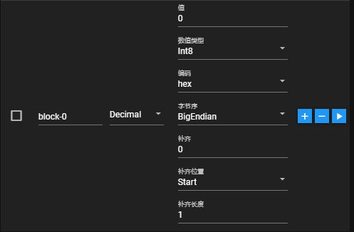
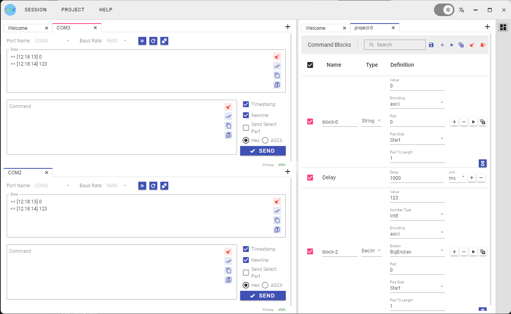

# Wavy

[简体中文](README_zh.md)

Target: Build a protocol testing tool that supports various connection methods.

## Features

- Supports Windows/Mac/Linux.
- Supports multiple connection sessions.
- Multiple encoding options: Hex/ASCII/Base64.
- Supports sending only the selected text as command.
- Project management support for convenient handling and sharing of test instructions.
- Advanced command blocks:
  - String: Supports features such as length, padding, padding position, padding length, encoding, etc.
  - Decimal: Supports features like type, padding, padding position, padding length, encoding, byte order, etc.
  - Delay: Insert a delay timer between two blocks.
- Supports sending a single command block or multiple command blocks to either a single session or multiple sessions.
- Supports saving commands and logs as text.





- Optimized interface with the introduction of Lumino, facilitating drag-and-drop functionality, layout changes, and enhanced convenience for multiple connections, [vue3-lumino-widget](https://github.com/novrain/vue3-lumino-widget)
- Light/Dark themes.
- English/Chinese Languages.




## Install

- Windows Store

[](https://www.microsoft.com/store/apps/9PFS4672J8M2)

## Development

### Versions

- Nodejs: 18.18.2
- Electron: 28.1.3

### Build

#### Install npm packages

```shell
yarn
```

#### Run dev

```shell
npm run electron:dev
```

#### Build vite project and make release

```shell
npm run vite:build
npm run forge:make
```

## Sponsor

- [A Star⭐](https://github.com/novrain/wavy)
- [Watch](https://github.com/novrain/wavy/subscription)
- If you find it useful and are willing to
  
  
  
  [PayPal](https://paypal.me/novrainn)
