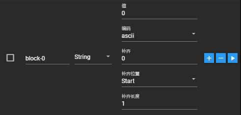
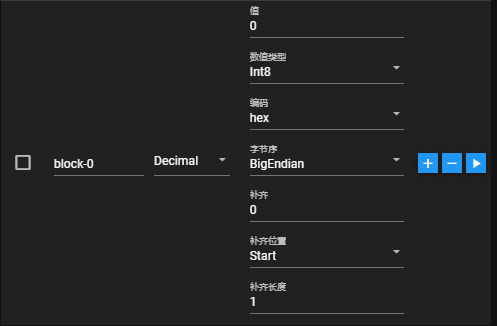
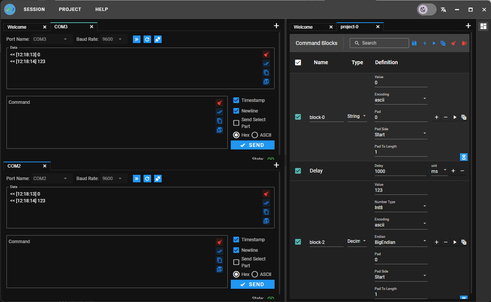
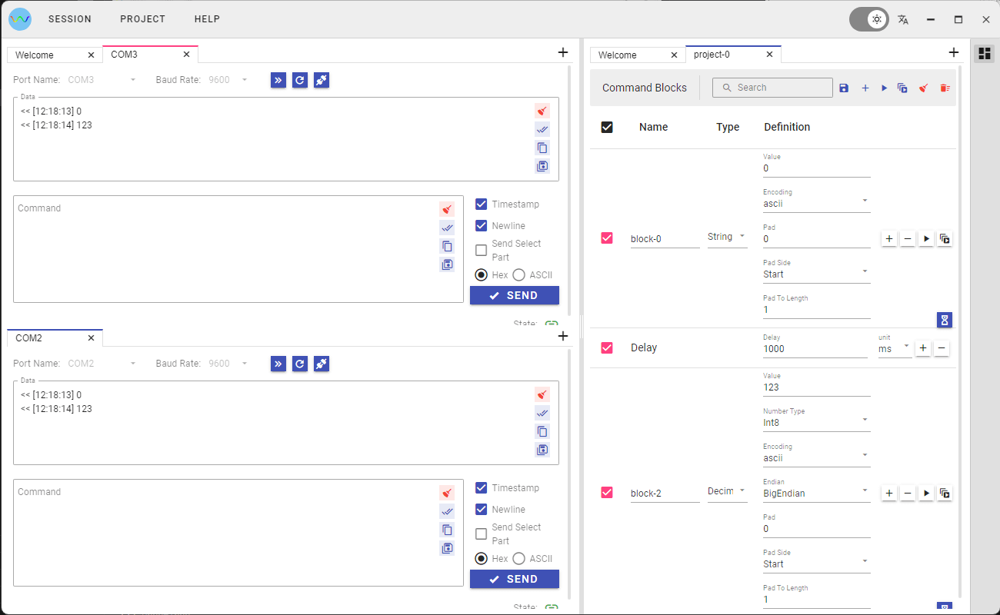
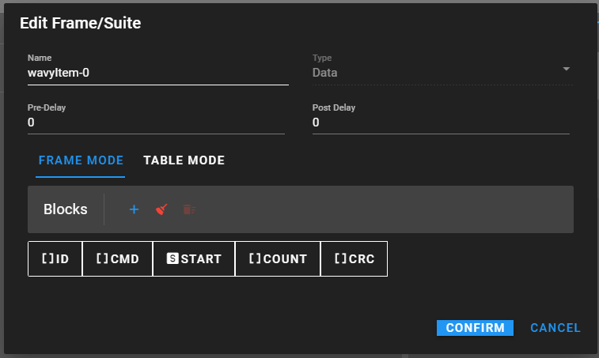
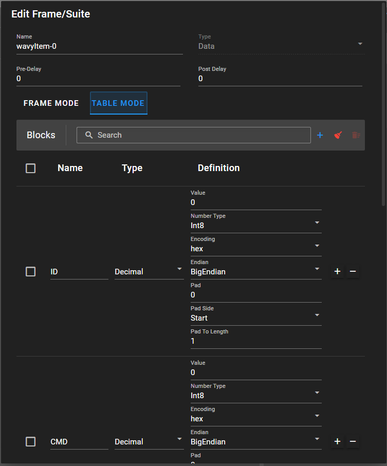
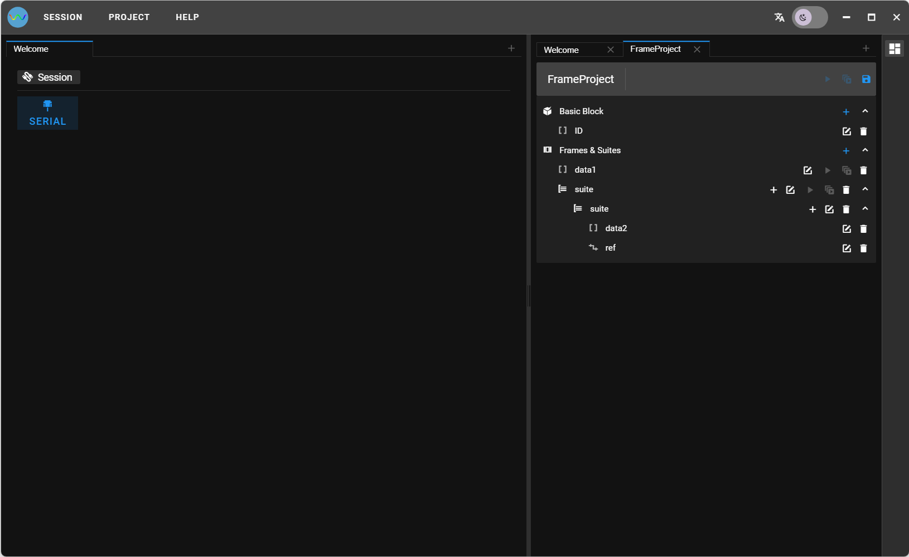

# Wavy

[English](README.md)

目标：支持多种连接方式的协议测试工具.

## 功能特性

- 支持Windows/Mac/Linux
- 支持多连接会话
- 支持Serial/TCP Client/TCP Server
- 支持多种编码：Hex/ASCII/Base64
- 支持仅发送选中的部分指令
- 支持工程管理，便于管理分享测试指令
- 高级命令块：
  - String: 支持长度/补齐/补齐位置/补齐长度/编码等特性
  - Decimal: 支持类型/补齐/补齐位置/补齐长度/编码/字节序等特性
  - Delay：在命令块之间插入延时
- 支持向单个会话或多个会话发送单个命令块或多个命令块
- 支持保存命令与日志为文本





- 优化的界面，引入了Lumino, 方便的拖拽功能，改变布局，多连接时更便捷，[vue3-lumino-widget](https://github.com/novrain/vue3-lumino-widget)
- 支持Light/Dark两种主题
- 支持中文/英文





- 支持数据帧/Suite工程: 可以构建复杂的指令帧，例如按照Modbus协议构建可以重复使用的数据指令集。
  - Frame/Reference
  - Suite
  





## 安装

- Windows Store

[](https://www.microsoft.com/store/apps/9PFS4672J8M2)

## 开发

### 版本要求

- Nodejs: 18.18.2
- Electron: 28.3.0

### 构建

#### 安装

```shell
yarn
```

#### 开发调试

```shell
npm run electron:dev
```

#### 构建Release

```shell
npm run vite:build
npm run forge:make
```

## 赞赏

- [A Star⭐](https://github.com/novrain/wavy)
- [给个关注](https://github.com/novrain/wavy/subscription)
- 如果觉得好用，又乐意打赏的话
  
  
  
  [PayPal](https://paypal.me/novrainn)
