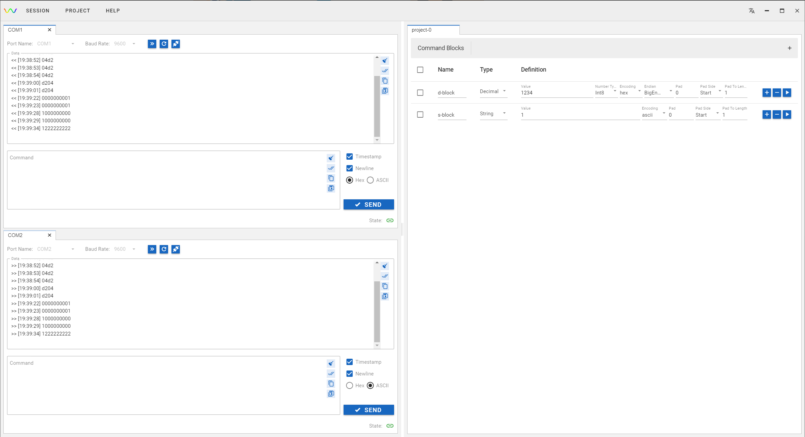

# Wavy

[English](README.md)

目标：支持多种连接方式的协议测试工具.

## Serial port

### UI

- 引入了Lumino, 方便的拖拽功能，改变布局，多连接时更便捷。[vue3-lumino-widget](https://github.com/novrain/vue3-lumino-widget)
- String/Decimal 命令块定义，方便编辑指令

两个串口间收发数据。



## 开发

### 版本要求

- Nodejs: 18.18.2
- Electron: 28.0.0

### 构建

#### 安装

```shell
yarn
```

#### 安装 electron-forge 工具链

```shell
npm exec --package=@electron-forge/cli -c "electron-forge import"
```

#### 开发调试

```shell
npm run electron:dev
```

#### 构建Release

```shell
npm run vite:build
npm run forge:make
```
